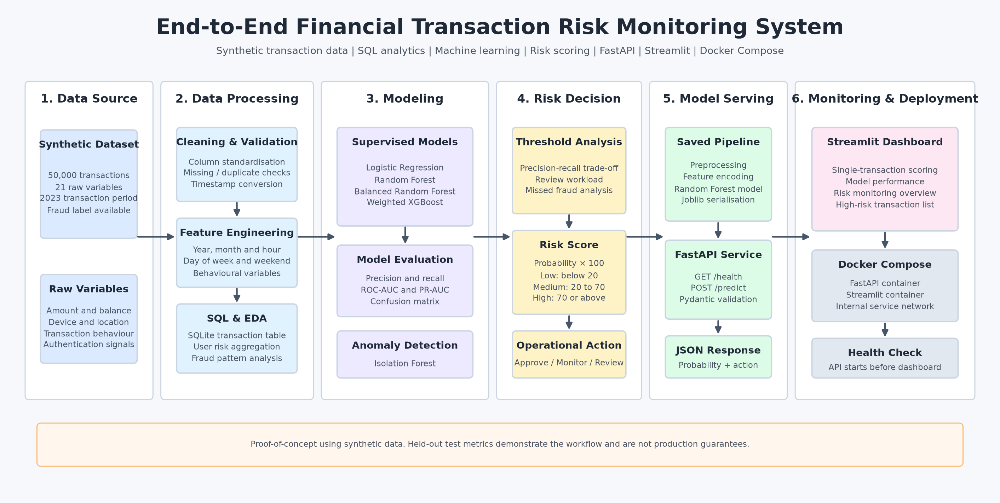
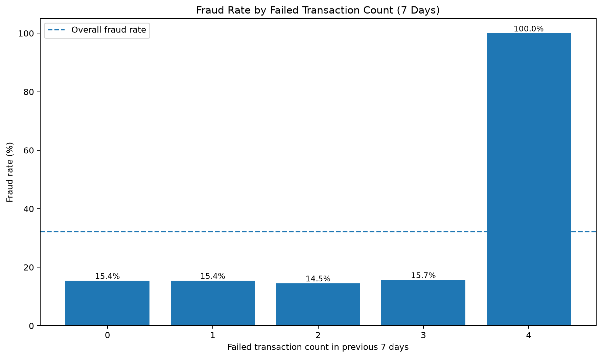
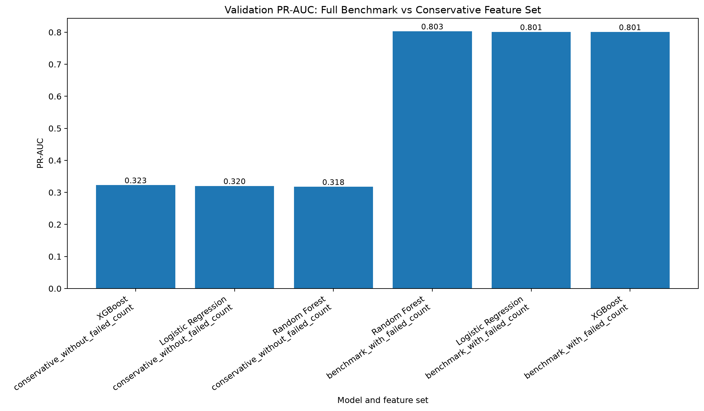
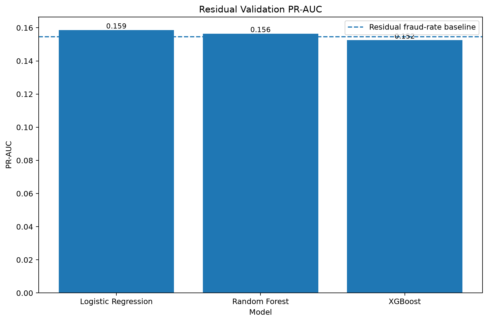

# Financial Transaction Risk Monitoring — Governance-Aware Prototype

An end-to-end portfolio project for financial transaction risk monitoring using Python, SQL, machine learning, FastAPI, Streamlit, Docker Compose, and model-risk governance.

The project originally produced strong fraud-detection scores on a synthetic dataset. A later methodology audit showed that much of this apparent performance came from a deterministic proxy feature. The final V2 system therefore focuses on **proxy detection, temporal validation, honest model rejection, transparent policy rules, and governance-aware deployment** rather than presenting an inflated production claim.

> **Important**
>
> This repository uses a synthetic dataset. The rule and diagnostic model are not approved for production use, transaction blocking, automatic approval, automatic rejection, or any other customer-impact decision.

---

## Project Highlights

- 50,000 synthetic financial transactions covering January–December 2023.
- Python and SQL data cleaning, exploratory analysis, and feature engineering.
- Logistic Regression, Random Forest, XGBoost, and Isolation Forest experiments.
- Feature-leakage and proxy-feature audit.
- Chronological Train / Validation / Test evaluation.
- Benchmark-versus-conservative feature ablation.
- Residual-signal analysis after removing the deterministic proxy segment.
- Explicit decision to reject a weak residual model from deployment.
- Governance-aware FastAPI service.
- Streamlit dashboard for rule, validation, and governance evidence.
- Docker Compose deployment.
- 17 automated API and validation tests.

---

## Architecture



```text
Synthetic Transaction Data
        ↓
Cleaning, EDA and SQL Analytics
        ↓
Feature Leakage and Proxy Audit
        ↓
Chronological Validation and Feature Ablation
        ↓
Transparent Synthetic Rule + Residual Diagnostic Model
        ↓
Governance Policy: Do Not Deploy / No Automated Decision
        ↓
FastAPI Governance Service
        ↓
Streamlit Validation Dashboard
        ↓
Docker Compose + Automated Tests
```

---

## Dataset

| Item | Value |
|---|---:|
| Transactions | 50,000 |
| Original variables | 21 |
| Cleaned variables | 26 |
| Time period | January–December 2023 |
| Normal transactions | 33,933 |
| Fraud transactions | 16,067 |
| Synthetic fraud rate | 32.134% |
| Missing values | 0 |
| Duplicate rows | 0 |

Example variables include:

- transaction amount and account balance;
- transaction type and merchant category;
- device type and location;
- suspicious IP indicator;
- previous fraudulent activity;
- daily and failed transaction counts;
- card age and card type;
- authentication method;
- transaction distance.

The source dataset is not committed to the repository. Place it at:

```text
data/raw/synthetic_fraud_dataset.csv
```

---

## Why the Methodology Was Upgraded

Early benchmark models appeared to achieve PR-AUC values around 0.80. The methodology audit found that:

- `risk_score` had an unclear target-generation relationship and was excluded;
- `failed_transaction_count_7d >= 4` mapped to a 100% fraud rate in the synthetic data;
- the high benchmark performance was therefore largely driven by a deterministic synthetic proxy;
- random train/test splits overstated the realism of the evaluation.

The V2 methodology replaced this interpretation with:

1. chronological splitting;
2. feature-leakage and proxy auditing;
3. benchmark-versus-conservative ablation;
4. residual-signal analysis;
5. independent out-of-time testing;
6. an explicit deployment-rejection decision.

---

## Temporal Evaluation Design

The cleaned data is sorted chronologically and divided into:

| Split | Rows | Purpose |
|---|---:|---|
| Train | 30,000 | Model fitting |
| Validation | 10,000 | Model and threshold selection |
| Test | 10,000 | Final independent evaluation |

The residual analysis excludes transactions where:

```text
failed_transaction_count_7d >= 4
```

Residual split sizes are:

| Split | Rows | Fraud rate |
|---|---:|---:|
| Train | 24,026 | 15.27% |
| Validation | 8,047 | 15.46% |
| Test | 7,973 | 15.06% |

---

## Proxy-Feature Audit

The strongest synthetic pattern was:

```text
failed_transaction_count_7d >= 4
```

On the independent temporal test split, this transparent rule produced approximately:

| Metric | Result |
|---|---:|
| Review rate | 20.27% |
| Precision | 100.00% |
| Recall | 62.79% |
| False positives | 0 |
| False negatives | 1,201 |

This is useful for demonstrating proxy detection and rule auditing, but it is **not evidence of real banking fraud performance**.



---

## Feature Ablation Results

Two feature sets were compared:

- **Benchmark**: retained `failed_transaction_count_7d`;
- **Conservative**: excluded both `risk_score` and `failed_transaction_count_7d`.

The benchmark models retained high PR-AUC because they still had access to the deterministic proxy.

The selected conservative XGBoost model produced the following independent test results:

| Metric | Result |
|---|---:|
| Review rate | 20.31% |
| Precision | 31.71% |
| Recall | 19.95% |
| F1 | 24.49% |
| ROC-AUC | 0.4921 |
| PR-AUC | 0.3204 |
| Test fraud prevalence | 0.3228 |

The model did not outperform a prevalence baseline in a meaningful way.



---

## Residual-Signal Analysis

The residual analysis focuses only on transactions below the deterministic threshold:

```text
failed_transaction_count_7d < 4
```

Logistic Regression was selected using validation data, but its independent test results were:

| Metric | Result |
|---|---:|
| ROC-AUC | 0.4875 |
| PR-AUC | 0.1458 |
| Fraud prevalence | 0.1506 |
| Relative PR-AUC uplift | -3.20% |

The residual model therefore failed to demonstrate reliable out-of-time ranking value.

The formal decision is:

```text
do_not_deploy_residual_model
```



Detailed validation and governance rationale are documented in:

```text
docs/01_model_validation_and_risk_assessment.md
```

---

## Final Decision Policy

The final policy has two non-production layers.

### Layer 1 — Transparent Synthetic Rule

```text
failed_transaction_count_7d >= 4
```

Result:

```text
Synthetic Rule Alert
```

Allowed interpretation:

- portfolio demonstration;
- transparent rule auditing;
- manual-review workload analysis.

Not allowed:

- production fraud claim;
- automatic approval;
- automatic rejection;
- transaction blocking;
- customer-impact decisions.

### Layer 2 — Residual Diagnostic Model

Artifact:

```text
models/residual_logistic_diagnostic_pipeline.pkl
```

Role:

```text
diagnostic_only
```

The model can return a diagnostic score for engineering and model-risk review, but it has no decision authority.

Policy and metadata files:

```text
models/decision_policy.json
models/model_metadata.json
models/diagnostic_model_feature_columns.json
```

---

## FastAPI Governance Service

The API exposes:

| Method | Endpoint | Description |
|---|---|---|
| GET | `/` | Service and policy information |
| GET | `/health` | Artifact and governance health status |
| POST | `/predict` | Transparent rule and diagnostic evaluation |

Start the API:

```powershell
python -m uvicorn app.api:app --reload
```

Open Swagger documentation:

```text
http://localhost:8000/docs
```

### Residual Diagnostic Example

For:

```text
failed_transaction_count_7d = 3
```

the API returns a response similar to:

```json
{
  "rule_triggered": false,
  "decision_source": "residual_diagnostic_model",
  "diagnostic_model_applied": true,
  "diagnostic_probability": 0.491998,
  "deployment_eligible": false,
  "automatic_decision_approved": false,
  "alert_label": "No Reliable Automated Decision"
}
```

### Synthetic Rule Example

For:

```text
failed_transaction_count_7d = 4
```

the API returns a response similar to:

```json
{
  "rule_triggered": true,
  "decision_source": "synthetic_failed_count_rule",
  "diagnostic_model_applied": false,
  "diagnostic_probability": null,
  "deployment_eligible": false,
  "automatic_decision_approved": false,
  "alert_label": "Synthetic Rule Alert",
  "recommended_action": "Manual review for portfolio demonstration only"
}
```

---

## Streamlit Dashboard

The dashboard contains four sections:

1. **Transaction Evaluation**
   - submits a transaction to FastAPI;
   - checks the transparent rule first;
   - shows a diagnostic score only when the transaction is outside the rule;
   - clearly states that no automated decision is approved.

2. **Model Validation**
   - shows temporal ablation results;
   - compares benchmark and conservative feature sets;
   - displays independent test evidence.

3. **Rule & Residual Analysis**
   - visualises the deterministic failed-count proxy;
   - compares residual models;
   - shows the two-layer workload trade-off;
   - displays the deployment-rejection decision.

4. **Governance Summary**
   - shows artifact role and eligibility;
   - lists approved and prohibited uses;
   - reports independent test metrics.

Start the dashboard in a second terminal:

```powershell
python -m streamlit run app/dashboard.py
```

Open:

```text
http://localhost:8501
```

The FastAPI service must also be running.

---

## Docker Compose

The API and dashboard run as separate services:

```text
Browser
   ↓
Streamlit container
   ↓  http://api:8000
FastAPI container
   ↓
Diagnostic artifact + policy files
```

Build and start:

```powershell
docker compose up -d --build
```

Check status:

```powershell
docker compose ps
```

Endpoints:

| Service | Address |
|---|---|
| API health | `http://localhost:8000/health` |
| Swagger docs | `http://localhost:8000/docs` |
| Dashboard | `http://localhost:8501` |

Stop:

```powershell
docker compose down
```

---

## Automated Tests

The test suite covers:

- root and health endpoints;
- residual diagnostic path;
- synthetic rule path;
- values above the rule threshold;
- negative and invalid numeric inputs;
- missing required fields;
- invalid timestamps;
- previously unseen categorical values;
- deployment and automatic-decision governance fields.

Run:

```powershell
python -m pytest -q
```

Expected result:

```text
17 passed
```

A Starlette deprecation warning may appear with the current test-client dependency combination. It does not indicate a failed test.

---

## Project Structure

```text
financial-transaction-risk-monitoring/
├── app/
│   ├── __init__.py
│   ├── api.py
│   └── dashboard.py
├── data/
│   ├── raw/
│   └── processed/
├── docs/
│   └── 01_model_validation_and_risk_assessment.md
├── models/
│   ├── decision_policy.json
│   ├── diagnostic_model_feature_columns.json
│   ├── model_metadata.json
│   └── residual_logistic_diagnostic_pipeline.pkl
├── outputs/
│   ├── architecture/
│   ├── figures/
│   └── validation and audit outputs
├── sql/
│   ├── 01_database_fraud_summary.sql
│   ├── 02_user_risk_features.sql
│   ├── 03_high_risk_transactions_rule_based.sql
│   ├── 04_transaction_type_fraud_summary.sql
│   └── 05_hourly_fraud_summary.sql
├── src/
│   ├── 00_feature_leakage_audit.py
│   ├── 01_data_cleaning.py
│   ├── 02_eda_fraud_analysis.py
│   ├── 03_sql_feature_engineering.py
│   ├── 04_baseline_model.py
│   ├── 04b_temporal_ablation_models.py
│   ├── 04c_residual_signal_analysis.py
│   ├── 05_class_imbalance_models.py
│   ├── 06_threshold_analysis.py
│   ├── 08_anomaly_detection.py
│   ├── 09_train_and_save_model.py
│   └── 10_generate_architecture_diagram.py
├── tests/
│   └── test_api.py
├── .dockerignore
├── .gitignore
├── compose.yaml
├── Dockerfile
├── requirements.txt
├── requirements-docker.txt
└── README.md
```

---

## Running the Analysis Pipeline

Create and activate a virtual environment:

```powershell
python -m venv .venv
Set-ExecutionPolicy -Scope Process -ExecutionPolicy Bypass
.\.venv\Scripts\Activate.ps1
```

Install dependencies:

```powershell
python -m pip install -r requirements.txt
```

Place the dataset at:

```text
data/raw/synthetic_fraud_dataset.csv
```

Run the analysis in order:

```powershell
python src\01_data_cleaning.py
python src\02_eda_fraud_analysis.py
python src\03_sql_feature_engineering.py

# Historical benchmark experiments
python src\04_baseline_model.py
python src\05_class_imbalance_models.py
python src\06_threshold_analysis.py
python src\08_anomaly_detection.py

# V2 methodology and governance
python src\00_feature_leakage_audit.py
python src\04b_temporal_ablation_models.py
python src\04c_residual_signal_analysis.py
python src\09_train_and_save_model.py
python src\10_generate_architecture_diagram.py

# Final validation
python -m pytest -q
```

The benchmark scripts are retained as historical experiment evidence. They should not be interpreted as the final deployment recommendation.

---

## Key Lessons

- High performance should be investigated, not automatically celebrated.
- Random splits can misrepresent future transaction performance.
- A deterministic proxy can dominate model metrics.
- PR-AUC must be compared with fraud prevalence.
- Feature ablation is essential when leakage or proxy risk is suspected.
- A model that does not add out-of-time value should not be deployed.
- Transparent rules can be easier to audit than opaque models, but synthetic rules are not production evidence.
- Honest model rejection is a valid and valuable machine-learning outcome.
- Governance must be reflected in artifacts, APIs, dashboards, and tests—not only in documentation.

---

## Limitations

- The dataset is synthetic and has an unusually high fraud rate.
- The deterministic failed-count rule is a target-generation artifact.
- User overlap indicates that the temporal evaluation mainly covers future transactions from existing users.
- No real customer, banking, or payment data is included.
- No production authentication, authorisation, audit logging, encryption, or regulatory workflow is implemented.
- The diagnostic score is not calibrated for real-world decision-making.
- Concept drift and delayed fraud labels are not fully simulated.

---

## Future Improvements

- replace the synthetic dataset with realistic time-ordered transaction data;
- use group-aware validation for unseen customers;
- add delayed-label and concept-drift simulation;
- introduce cost-sensitive evaluation;
- add probability calibration only after meaningful ranking signal is established;
- add SHAP explanations for an approved candidate model;
- implement model and data versioning;
- add CI/CD and automated Docker tests;
- add authentication, audit logs, and case-management workflows;
- deploy to a cloud environment only after governance approval.

---

## Author

**Zeng Boyuan**

MSc Statistics student interested in data analytics, machine learning, financial risk monitoring, model governance, and applied AI.
