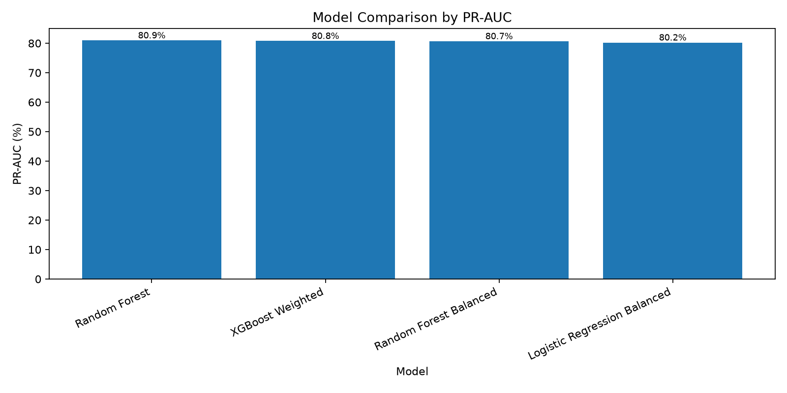
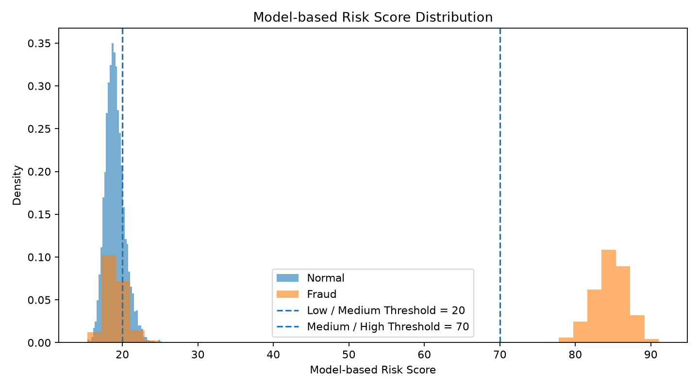

# Financial Transaction Risk Monitoring System

An end-to-end financial transaction fraud detection and risk monitoring prototype built with Python, SQL, machine learning, FastAPI, Streamlit and Docker Compose.

The project demonstrates the complete workflow from transaction data preparation and fraud analysis to supervised modeling, anomaly detection, operational risk scoring, API deployment and interactive monitoring.

> **Important:** This project uses a public synthetic dataset and is designed as a portfolio proof of concept. Test-set performance should not be interpreted as production banking performance.

---

## Project Overview

Financial institutions need to identify suspicious transactions while controlling false alerts and manual-review workload.

This project builds a transaction-level monitoring workflow that:

* cleans and validates transaction data;
* analyses fraud patterns using Python and SQL;
* engineers behavioural and time-related features;
* compares Logistic Regression, Random Forest and XGBoost;
* studies precision, recall and review-workload trade-offs;
* converts model probabilities into operational risk levels;
* supplements supervised learning with Isolation Forest;
* exposes the selected model through a FastAPI service;
* provides an interactive Streamlit monitoring dashboard;
* containerises the API and dashboard using Docker Compose.

---

## System Architecture


The main system workflow is:

```text
Synthetic Transaction Data
        ↓
Data Cleaning and Validation
        ↓
EDA and SQL Feature Engineering
        ↓
Supervised and Unsupervised Modeling
        ↓
Threshold Analysis and Risk Scoring
        ↓
Saved Machine Learning Pipeline
        ↓
FastAPI Inference Service
        ↓
Streamlit Monitoring Dashboard
        ↓
Docker Compose Deployment
```

---

## Dataset

The project uses a synthetic financial transaction fraud dataset containing:

| Item                 |                 Value |
| -------------------- | --------------------: |
| Transactions         |                50,000 |
| Original variables   |                    21 |
| Time period          | January–December 2023 |
| Normal transactions  |                33,933 |
| Fraud transactions   |                16,067 |
| Synthetic fraud rate |                32.13% |
| Missing values       |                     0 |
| Duplicate rows       |                     0 |

Example variables include:

* transaction amount and account balance;
* transaction type and merchant category;
* device type and location;
* suspicious IP indicator;
* previous fraudulent activity;
* recent failed transaction count;
* daily transaction frequency;
* card age and card type;
* authentication method;
* transaction distance.

The original `risk_score` variable was intentionally excluded from model training because it showed a strong relationship with the target and could introduce target leakage.

The dataset itself is not committed to this repository. Place the source file at:

```text
data/raw/synthetic_fraud_dataset.csv
```

before rerunning the complete data pipeline.

---

## Technology Stack

| Area                  | Technologies                                |
| --------------------- | ------------------------------------------- |
| Data processing       | Python, Pandas, NumPy                       |
| Database and querying | SQLite, SQL                                 |
| Visualisation         | Matplotlib, Streamlit                       |
| Machine learning      | Scikit-learn, XGBoost                       |
| Supervised models     | Logistic Regression, Random Forest, XGBoost |
| Anomaly detection     | Isolation Forest                            |
| Model serving         | FastAPI, Pydantic, Uvicorn                  |
| Dashboard             | Streamlit                                   |
| Model persistence     | Joblib                                      |
| Deployment            | Docker, Docker Compose                      |

---

## Project Structure

```text
financial-transaction-risk-monitoring/
├── app/
│   ├── __init__.py
│   ├── api.py
│   └── dashboard.py
├── data/
│   ├── raw/
│   └── processed/
├── models/
│   ├── fraud_detection_random_forest_pipeline.pkl
│   ├── model_feature_columns.json
│   └── model_metadata.json
├── notebooks/
├── outputs/
│   ├── architecture/
│   ├── figures/
│   └── analysis outputs
├── sql/
│   ├── 01_database_fraud_summary.sql
│   ├── 02_user_risk_features.sql
│   ├── 03_high_risk_transactions_rule_based.sql
│   ├── 04_transaction_type_fraud_summary.sql
│   └── 05_hourly_fraud_summary.sql
├── src/
│   ├── 01_data_cleaning.py
│   ├── 02_eda_fraud_analysis.py
│   ├── 03_sql_feature_engineering.py
│   ├── 04_baseline_model.py
│   ├── 05_class_imbalance_models.py
│   ├── 06_threshold_analysis.py
│   ├── 07_risk_scoring.py
│   ├── 08_anomaly_detection.py
│   ├── 09_train_and_save_model.py
│   └── 10_generate_architecture_diagram.py
├── .dockerignore
├── .gitignore
├── compose.yaml
├── Dockerfile
├── requirements.txt
├── requirements-docker.txt
└── README.md
```

---

## Data Processing and Analysis

### Data Cleaning

The cleaning pipeline:

* standardises column names;
* converts timestamps to datetime format;
* checks missing values and duplicate records;
* generates year, month, day, hour and day-of-week variables;
* creates a weekend indicator;
* exports the cleaned dataset for downstream analysis.

The processed dataset contains 50,000 rows and 26 columns.

### Exploratory Data Analysis

The EDA examines fraud patterns by:

* transaction type;
* device type;
* location;
* merchant category;
* authentication method;
* hour of day;
* month;
* recent failed transaction count;
* historical fraudulent activity;
* suspicious IP address.

Individual categorical variables showed relatively weak separation, which motivated multivariate machine-learning models.

### SQL Analytics

The cleaned transactions are loaded into SQLite.

SQL queries generate:

* database-level fraud summaries;
* user-level behavioural profiles;
* transaction-type fraud statistics;
* hourly fraud summaries;
* rule-based high-risk transaction lists.

The rule-based screen increased the observed fraud rate from 32.13% to 41.67%, but selected approximately 63.7% of all transactions. This demonstrated that fixed rules can enrich fraud concentration while still creating a substantial manual-review workload.

---

## Model Development

### Baseline Models

A majority-class baseline and Logistic Regression were used to establish reference performance.

| Model               | Accuracy | Precision | Recall |     F1 | ROC-AUC | PR-AUC |
| ------------------- | -------: | --------: | -----: | -----: | ------: | -----: |
| Majority baseline   |   67.87% |     0.00% |  0.00% |  0.00% |  50.00% | 32.13% |
| Logistic Regression |   86.66% |    93.88% | 62.56% | 75.08% |  80.17% | 80.21% |

The majority baseline illustrates why accuracy alone is inappropriate for fraud-detection evaluation.

### Class-Imbalance Model Comparison

| Model                        | Accuracy | Precision | Recall |     F1 | ROC-AUC | PR-AUC |
| ---------------------------- | -------: | --------: | -----: | -----: | ------: | -----: |
| Random Forest                |   87.72% |   100.00% | 61.78% | 76.38% |  81.24% | 80.94% |
| XGBoost Weighted             |   87.72% |   100.00% | 61.78% | 76.38% |  81.00% | 80.75% |
| Random Forest Balanced       |   87.72% |   100.00% | 61.78% | 76.38% |  80.76% | 80.67% |
| Logistic Regression Balanced |   72.81% |    56.01% | 71.68% | 62.88% |  80.16% | 80.21% |

Random Forest achieved the highest test-set PR-AUC and was selected as the primary model.



The selected model is conservative:

* alerts have high observed precision;
* false-positive review workload is low;
* some fraudulent transactions remain undetected;
* threshold selection must reflect business costs and review capacity.

---

## Threshold Analysis

Fraud-detection thresholds were evaluated using:

* precision;
* recall;
* false-positive rate;
* missed-fraud rate;
* manual-review volume.

At the selected high-risk threshold:

| Metric                |  Result |
| --------------------- | ------: |
| Transactions reviewed |   1,985 |
| Review rate           |  19.85% |
| True positives        |   1,985 |
| False positives       |       0 |
| False negatives       |   1,228 |
| High-risk precision   | 100.00% |
| High-risk recall      |  61.78% |

The model probabilities are concentrated into relatively distinct score regions. Therefore, several thresholds between approximately 0.30 and 0.70 produce the same binary classifications.

---

## Operational Risk Scoring

Model probabilities are converted to a risk score from 0 to 100.

| Risk level | Probability range  | Recommended action        |
| ---------- | ------------------ | ------------------------- |
| Low        | Below 0.20         | Auto Approve              |
| Medium     | 0.20 to below 0.70 | Monitor / Secondary Check |
| High       | 0.70 or above      | Manual Review / Alert     |

Test-set risk distribution:

| Risk level | Transactions |  Share | Observed fraud rate |
| ---------- | -----------: | -----: | ------------------: |
| Low        |        6,405 | 64.05% |              15.04% |
| Medium     |        1,610 | 16.10% |              16.46% |
| High       |        1,985 | 19.85% |             100.00% |



The high-risk precision is a held-out synthetic test-set result and should not be interpreted as guaranteed production performance.

---

## Anomaly Detection

Isolation Forest was tested as an unsupervised complementary monitoring layer.

| Metric                         | Result |
| ------------------------------ | -----: |
| ROC-AUC                        | 53.93% |
| PR-AUC                         | 35.14% |
| Precision at top 10% anomalies | 35.70% |
| Recall at top 10% anomalies    | 11.11% |

The anomaly detector performed only slightly above the dataset baseline and was not selected as the primary fraud model.

Its potential role is instead to support:

* previously unseen transaction patterns;
* delayed or incomplete fraud labels;
* exploratory investigation;
* supplementary early-warning monitoring.

---

## FastAPI Inference Service

The trained preprocessing and Random Forest model are saved as one pipeline:

```text
models/fraud_detection_random_forest_pipeline.pkl
```

The API provides:

| Method | Endpoint   | Description                  |
| ------ | ---------- | ---------------------------- |
| GET    | `/`        | Service information          |
| GET    | `/health`  | Model and API health status  |
| POST   | `/predict` | Transaction fraud prediction |

Run the API locally:

```powershell
python -m uvicorn app.api:app --reload
```

Open the interactive documentation:

```text
http://localhost:8000/docs
```

Example prediction response:

```json
{
  "fraud_probability": 0.232139,
  "model_risk_score": 23.21,
  "default_binary_prediction": 0,
  "risk_level": "Medium",
  "recommended_action": "Monitor / Secondary Check"
}
```

---

## Streamlit Dashboard

The Streamlit interface includes four monitoring sections:

1. **Transaction Risk Scoring**

   * submits raw transaction data to FastAPI;
   * returns fraud probability and risk level;
   * displays an operational recommendation.

2. **Model Performance**

   * compares supervised models;
   * displays PR-AUC and recall;
   * compares supervised and unsupervised approaches.

3. **Risk Monitoring Overview**

   * summarises Low, Medium and High risk groups;
   * visualises risk-level distributions;
   * displays fraud rates and model-score distributions.

4. **High-risk Transactions**

   * displays the highest-scoring transactions;
   * supports CSV download for investigation.

Run the dashboard locally:

```powershell
python -m streamlit run app/dashboard.py
```

Open:

```text
http://localhost:8501
```

The FastAPI service must also be running when using real-time transaction scoring.

---

## Docker Deployment

The FastAPI service and Streamlit dashboard are containerised as separate services.

```text
Browser
   ↓
Streamlit container
   ↓  http://api:8000
FastAPI container
   ↓
Saved Random Forest pipeline
```

Build and start the system:

```powershell
docker compose up -d --build
```

Check container status:

```powershell
docker compose ps
```

Expected services:

```text
fraud-risk-api          running / healthy
fraud-risk-dashboard    running
```

Available endpoints:

| Service               | Address                        |
| --------------------- | ------------------------------ |
| API health check      | `http://localhost:8000/health` |
| Swagger documentation | `http://localhost:8000/docs`   |
| Streamlit dashboard   | `http://localhost:8501`        |

Stop and remove the containers:

```powershell
docker compose down
```

---

## Running the Full Analysis Pipeline

Create and activate a virtual environment:

```powershell
python -m venv .venv
Set-ExecutionPolicy -Scope Process -ExecutionPolicy Bypass
.\.venv\Scripts\Activate.ps1
```

Install dependencies:

```powershell
python -m pip install -r requirements.txt
```

Place the dataset at:

```text
data/raw/synthetic_fraud_dataset.csv
```

Run the scripts in order:

```powershell
python src\01_data_cleaning.py
python src\02_eda_fraud_analysis.py
python src\03_sql_feature_engineering.py
python src\04_baseline_model.py
python src\05_class_imbalance_models.py
python src\06_threshold_analysis.py
python src\07_risk_scoring.py
python src\08_anomaly_detection.py
python src\09_train_and_save_model.py
python src\10_generate_architecture_diagram.py
```

---

## Key Business Insights

* Fraud detection should not be assessed using accuracy alone.
* Precision and recall represent different operational costs.
* Fixed fraud rules can improve fraud concentration but may create excessive review volume.
* A conservative Random Forest can produce reliable alerts while still missing some fraud.
* Risk tiers are more actionable than a single binary prediction.
* Unsupervised anomaly detection is useful as a supplementary layer rather than a replacement for supervised fraud models.
* Model thresholds should be selected according to investigation capacity and the financial cost of missed fraud.

---

## Limitations

* The dataset is synthetic and has a much higher fraud rate than most real financial systems.
* The project does not contain real customer or banking information.
* Test-set results are not production guarantees.
* Model probabilities may require calibration before real-world use.
* Concept drift and changing fraud behaviour are not simulated.
* The prototype does not include authentication, role-based access control or encrypted data storage.
* A production system would require real-time monitoring, retraining, audit logs, governance and compliance review.

---

## Possible Future Improvements

* probability calibration;
* cost-sensitive threshold optimisation;
* SHAP-based model explanations;
* temporal validation and concept-drift monitoring;
* model and data versioning;
* real-time transaction streaming;
* database-backed investigation case management;
* user authentication and role-based access;
* cloud deployment;
* automated testing and CI/CD.

---

## Author

**Zeng Boyuan**

MSc Statistics student with interests in data analytics, machine learning, financial risk monitoring and applied AI.